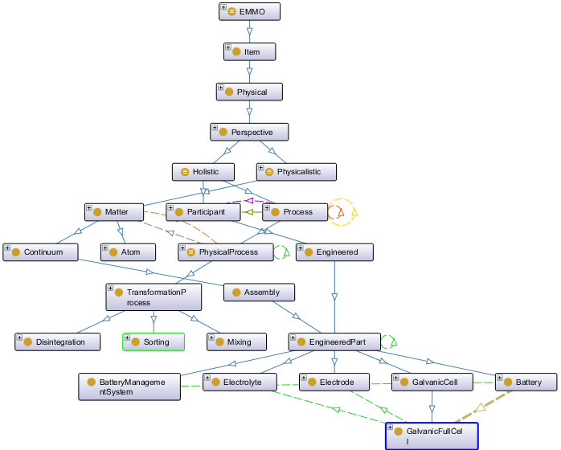

Ontology for the Battery Value Chain (BVC), e. g. for the the eLi / eLi-PLUS project 
see https://database.lithium-institute.eu
and https://www.lithium-institute.eu/

Based on EMMO: https://github.com/emmo-repo/EMMO
using Protégé: https://github.com/emmo-repo/EMMO/blob/master/doc/protege-setup.md
and FaCT++-Reasoner: https://github.com/emmo-repo/EMMO/blob/master/doc/installing_factplusplus.md

Basically, this ontology aims to model processes along the Battery value chain. Processes are holistic perspective elements that transform inputs/educts (matter, energy, information) into output/products (matter, energy, information) with the help of tools (devices, algorithms). They can be decomposed into sub-processes and have predecessor and successor processes. 

With regard to EMMO, the following questions arise:
Classes:
- There seems to be no concept of energy. Could it be a subclass of Physicalistic/Field?
- Participant/Engineered contains Material and Device, but nothing like EngineeredParts, consisting of sub parts and finaly material. should EngineeredParts be added as Participant?
- Perceptual/SymbolicComposition may represent Information in general, but to be part of a process, it must subclass Holistic/Participant, e. g. Semiotic/Sign or is there a better solution?
- If Manufacturing is a physical process mainly focused on transforming material, shouldn't there be something like an InformationalProcess focused on transforming information then?

Properties:
- Should hasSuccessor/hasPredecessor be added as subproperties of mereotopolocigal/connected/hasContactWith?
- Should hasInput/hasEduct and hasOutput/hasProduct be added as subproperties of mereotopolocigal/connected/hasPart/hasParticipant?