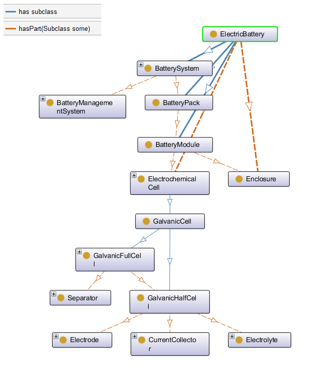

## Battery Value Chain Ontology

Ontology for the Battery Value Chain (BVC), work in progress

Official public repo: https://github.com/Battery-Value-Chain-Ontology/ontology

## About

Basically, this ontology aims to model processes along the Battery value chain. Processes are holistic perspective elements that transform inputs/educts (matter, energy, information) into output/products (matter, energy, information) with the help of tools (devices, algorithms). They can be decomposed into sub-processes and have predecessor and successor processes. 

The BVCO is a cross-project development under the coordination of Fraunhofer ISC (both EU and national research projects).

Based on GPO: https://github.com/General-Process-Ontology/ontology  
and EMMO: https://github.com/emmo-repo/EMMO  
using Protégé: https://github.com/emmo-repo/EMMO/blob/master/doc/protege-setup.md  
and FaCT++-Reasoner: https://github.com/emmo-repo/EMMO/blob/master/doc/installing_factplusplus.md

use cases: e. g. for the the eLi / eLi-PLUS and KiProBatt-Project, see:  
- https://database.lithium-institute.eu  
- https://www.lithium-institute.eu/  
- https://kiprobatt.de  
- https://onto-wiki.eu  

## EMMO and Battery Value Chain Ontology (BVCO) 

With regard to EMMO, the following questions are addressed:
Classes:
- There seems to be no concept of energy. Could it be a subclass of Physicalistic/Field?
- Participant/Engineered contains Material and Device, but nothing like EngineeredParts, consisting of sub parts and finaly material. should EngineeredParts be added as Participant?
- Perceptual/SymbolicComposition may represent Information in general, but to be part of a process, it must subclass Holistic/Participant, e. g. Semiotic/Sign or is there a better solution?
- If Manufacturing is a physical process mainly focused on transforming material, shouldn't there be something like an InformationalProcess focused on transforming information then?

Properties:
- Should hasSuccessor/hasPredecessor be added as subproperties of mereotopolocigal/connected/hasContactWith?
- Should hasInput/hasEduct and hasOutput/hasProduct be added as subproperties of mereotopolocigal/connected/hasPart/hasParticipant?

## BattINFO and Battery Value Chain Ontology (BVCO) 

While [BattINFO](https://github.com/BIG-MAP/BattINFO) focuses on the internal components and chemical processes, BVCO is dedicated to the higher-level process chains for material processing and manufacturing and is therefore complementary to the BattINFO. The basic definition of the battery as a system is also made there. 

## License

The Battery Value Chain Ontology is released under the [Creative Commons Attribution 4.0 International](https://creativecommons.org/licenses/by/4.0/legalcode) license (CC BY 4.0).
